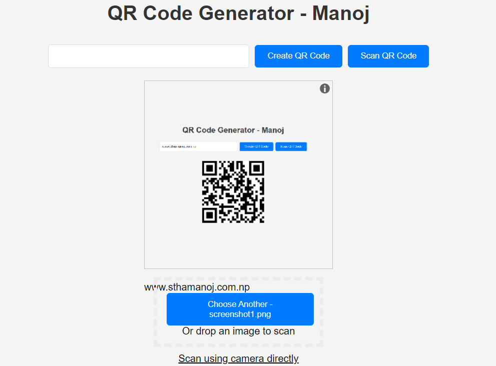

# QR Code Generator and Scanner
This is a simple QR Code Generator and Scanner application. It is built using JavaScipt and HTML. The application uses the `qrcode` library to generate QR codes and the `html5-qrcode` library to scan QR codes.

## How to use
1. Open the application in a web browser.
2. Enter the text you want to encode in the QR code.
3. Click the "Generate" button to generate the QR code.
4. To scan a QR code, click the "Scan" button and allow the application to access your camera.
5. Point the camera at the QR code to scan it.

## Libraries used
- [qrcode](https://cdnjs.cloudflare.com/ajax/libs/qrcodejs/1.0.0/qrcode.min.js)
- [html5-qrcode](https://unpkg.com/html5-qrcode)

## Screenshots

